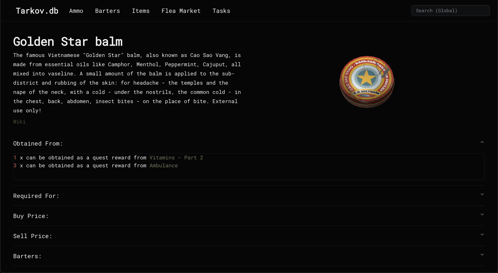
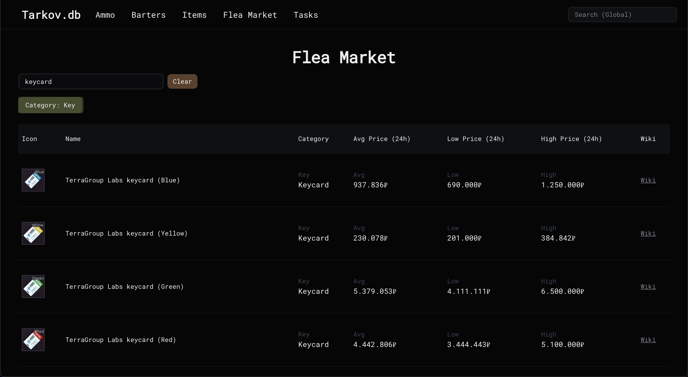

# Tarkov.db

**Tarkov.db** is a web application designed to provide *Escape from Tarkov* players with easy access to detailed information about in-game items and quests. The app offers a user-friendly interface for quick searches and exploration of game data.

## Features

- **Item Database**: Comprehensive list of in-game items with detailed information.  
- **Quest Tracker**: Information on quests, objectives, and rewards.  
- **Item Search**: Fast and efficient search functionality for items and quests.  
- **Responsive Design**: Optimized for both desktop and mobile devices.

## Item Page



## Flea Market Page



## Acknowledgments

Special thanks to [Tarkov.dev](https://tarkov.dev) for providing a free public API, which made this project possible.

## Installation

To run this project locally:

1. Clone the repository:
   ```bash
   git clone https://github.com/micnusz/tarkov-db.git
   ```
2. Navigate into the project directory:
   ```bash
   cd tarkov-db
   ```
3. Install dependencies:
   ```bash
   npm install
   ```
4. Start the development server:
   ```bash
   npm run dev
   ```
5. Open your browser and go to `http://localhost:3000` to view the application.
 
